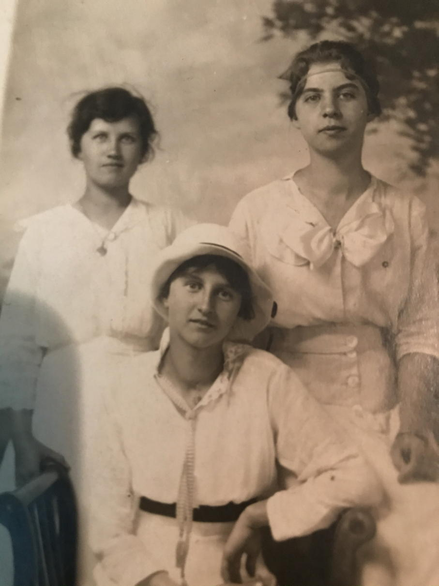
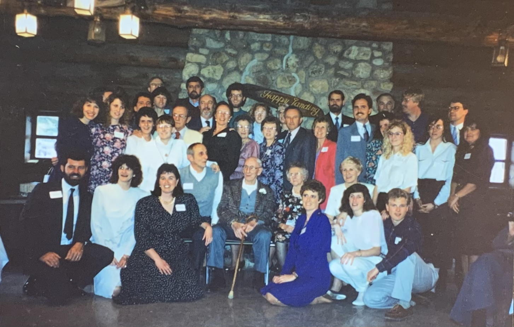

------

## Dora Miller Interview from 1981 ##

<audio controls> <source src="dora-miller_1981.mp3" /> </audio>

- Marge Miller's interview with Grandma
- Starts with Grandma's first job (when she was 17)
- Grandpa chiming in with lots of details!

## *"Miller Music", December 25th, 1990 ##

<audio controls> <source src="miller-music.mp3" /> </audio>

From the original note:

    Just a few tunes of our favorite songs.
    Please excuse mistakes & sour notes
    Love Mom

------

-  Left: Aunt Louise (Kuzzi)
- Center: Dora at 16 years old in 1916
- Right: unknown (not related)

------

- Some of the Millers at the 70th anniversary party
- March 23, 1991

------
