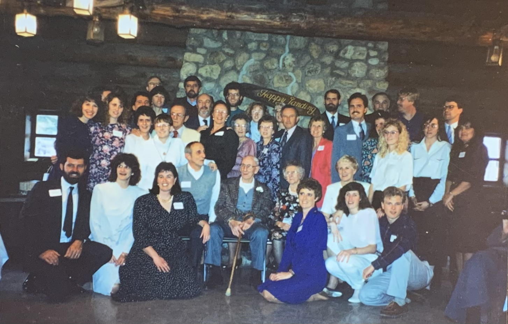

------

<table>

  <tr>
    <td>
      <strong> Dora Miller Interview from 1981 </strong>
      <audio controls> <source src="dora-miller_1981.mp3" /> </audio>
    </td>
    <td>
      <ul>
        <li> Marge Miller's interview with Grandma
        <li> Starts with Grandma's first job (when she was 17)
        <li> Grandpa chiming in with lots of details!
      </ul>
    </td>
  </tr>

  <tr>
    <td>
      <strong> <em>"Miller Music"</em>, December 25th, 1990 </strong>
      <audio controls> <source src="miller-music.mp3" /> </audio>
    </td>
    <td>
      From the original note:
      <blockquote>
        Just a few tunes of our favorite songs. 
        Please excuse mistakes & sour notes 
        Love Mom
      </blockquote>
    </td>
  </tr>

</table>

<table>

  <tr>
    <td>
      
    </td>
    <td>
      <ul>
        <li> Left: Aunt Louise (Kuzzi)
        <li> Center: Dora at 16 years old in 1916
        <li> Right: unknown (not related)
      </ul>
    </td>
  </tr>

</table>

<table>

  <tr>
    <td>
      
    </td>
    <td>
      March 23, 1991  
      Some of the Millers at the 70th anniversary party
    </td>
  </tr>

</table>

------
