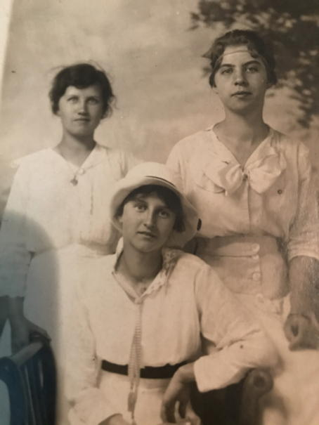

------

## Dora Miller Interview from 1981 ##

<audio controls>
   <source src="audio/dora-miller_1981.mp3" />
</audio>

- Marge Miller's interview with Grandma
- Starts with Grandma's first job (when she was 17)
- Grandpa chiming in with lots of details!

## *"Miller Music"*, December 25th, 1990 ##

<audio controls>
   <source src="audio/miller-music.mp3" />
</audio>

From the original note:

    Just a few tunes of our favorite songs.
    Please excuse mistakes & sour notes
    Love Mom

------

- Left: Aunt Louise (Kuzzi)
- Center: Dora at 16 years old in 1916
- Right: unknown (not related)

------

- Some of the Millers at the 70th anniversary party
- March 23, 1991

------

## Memorial Day 1965, Ken and Martha's place ##

(Re-)discovered in 2026 and digitized by Kerstin (Soderstrom) Barrette.

- Geneva, Illinois
- Dzarnowskis
- Soderstroms; Chris holding the camera?
- Bernts
- and ....?

<video height="200" controls>
   <source src="video/1965-05__memorial-day.mp4" />
</video>
